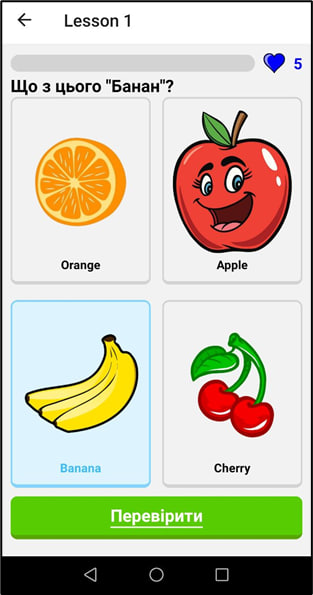
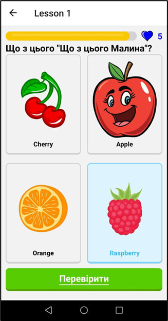
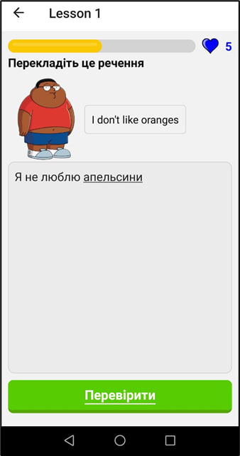
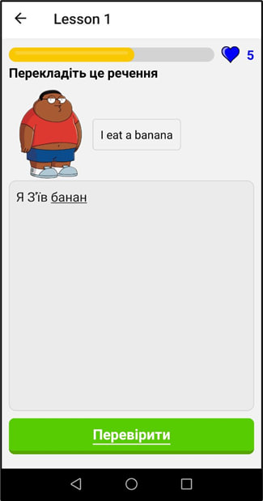
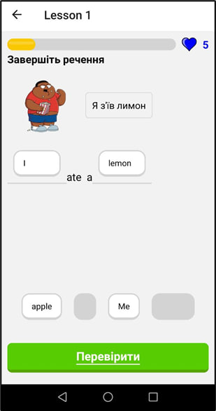
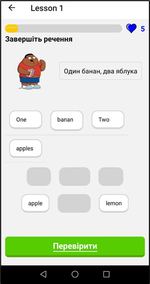
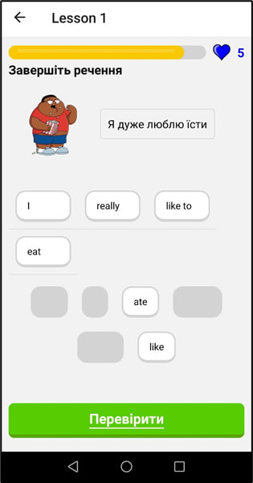
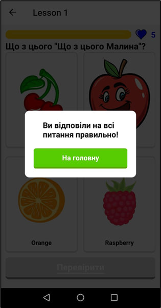
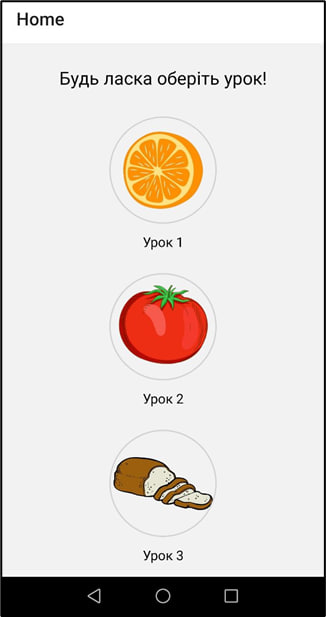

I created this application for learning English as my thesis, it is based on the work of Duolingo.

It has a main page with lessons arranged in the form of a roadmap, each lesson has words to study on different topics, there are questions with the choice of one or more correct answers, translate a sentence from English into Ukrainian and reverse, substitute the correct word in a sentence.

While working on the application, I acquired basic skills in working with React Native, for creating mobile applications and further studying this library, screenshots of the application itself are attached below:

1. Select correct card:

2. Translate sentence:

3. Substitute the correct word :

4. End of lesson:

5. Home screen:
